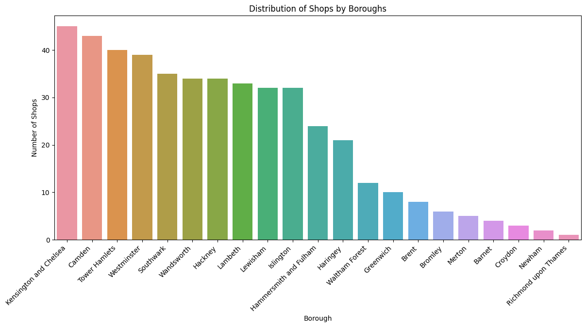
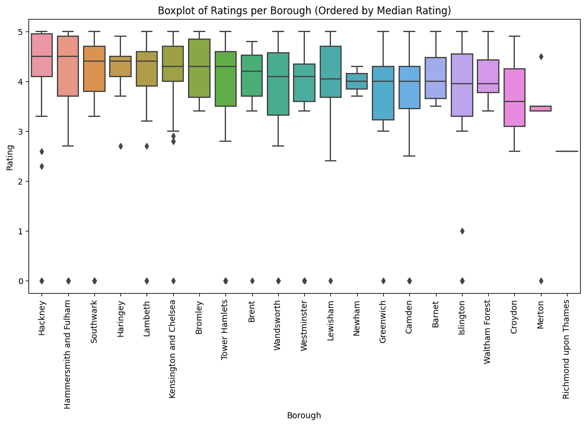
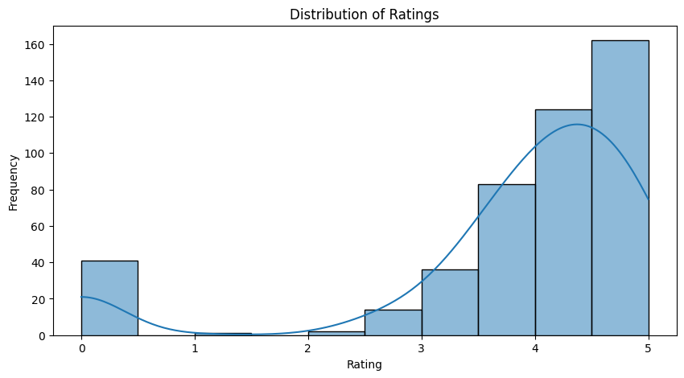
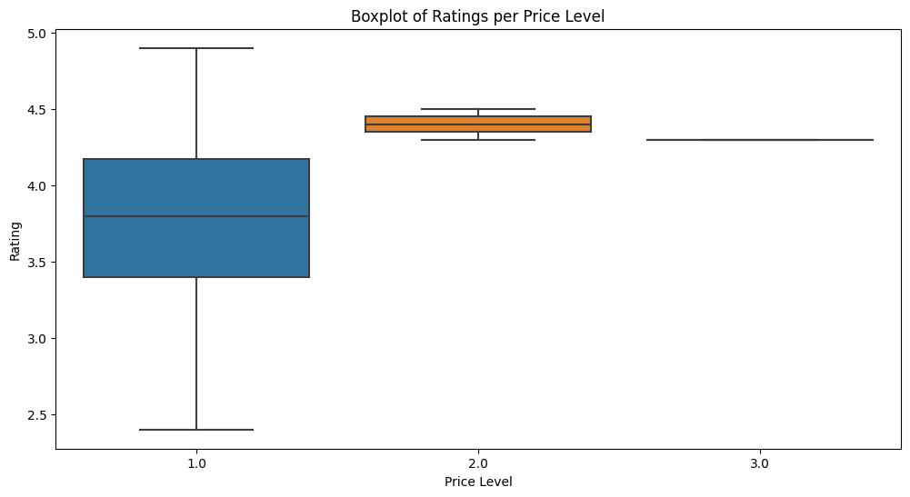
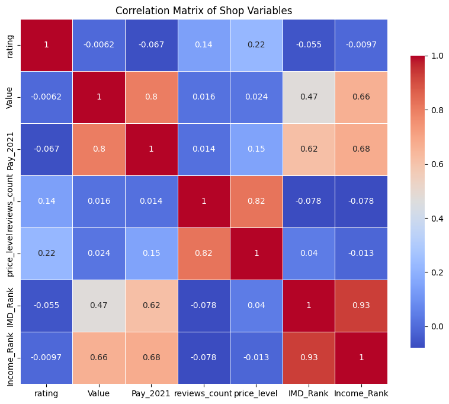

# London's Fashionable Finds

This project aims to analyse and visualise the trends and distribution of fashionable clothing stores in London. By leveraging open data sources and machine learning techniques, this project seeks to provide valuable insights for both customers and retailers in the fashion industry.

## Live Demo

You can test and view the ranking at the following link: [London Charity Vintage Shops](https://london-charity-vintage-shops.herokuapp.com/)

## Project Structure

The project is organised into the following directories and files:

- `01_Data_Collection`: Contains scripts and data files for collecting data from various sources, such as charity registers and geographic information.
- `02_Data_Preprocessing`: Scripts for cleaning and preprocessing the collected data to make it suitable for analysis and modelling.
- `03_EDA`: Scripts and notebooks for exploratory data analysis (EDA) and feature engineering.
- `04_Model`: Scripts for training and evaluating machine learning models on the processed data.
- `Documentation`: Contains project documentation files, including explanations and additional resources.
- `app.py`: The main script for running the web application.
- `templates`: Contains HTML templates for the web application.
- `requirements.txt`: A list of required Python packages for this project.

## Setup

To set up the project, follow these steps:

1. Clone the repository: `git clone https://github.com/AndriiDS/londons_fashionable_finds.git`
2. Set up a virtual environment (optional but recommended) and activate it:
   - `python -m venv env`
   - On Windows: `env\Scripts\activate`
   - On Linux/Mac: `source env/bin/activate`
3. Install the required packages: `pip install -r requirements.txt`
4. Run the data collection, preprocessing, EDA, and feature engineering scripts in order.
5. Train and evaluate the machine learning models using the scripts in the `04_Model` directory.
6. Launch the web application by running `app.py`.

## Contributing

We welcome contributions from the community. To contribute, please follow these steps:

1. Fork the repository on GitHub.
2. Clone your fork and create a new branch for your feature or bugfix.
3. Commit your changes to your branch and push them to your fork.
4. Open a pull request from your fork to the original repository.

Please ensure that your code follows the project's style guidelines and includes tests and documentation as appropriate.

## License

This project is released under the [MIT License](./LICENSE).

## Visualisations

The project includes various visualisations to help understand the data and trends:

### Distribution of Shops by Boroughs

### Boxplot of Ratings per Borough

### Distribution of Ratings

### Boxplot of Ratings per Price Level

### Correlation Matrix of Shop Variables

